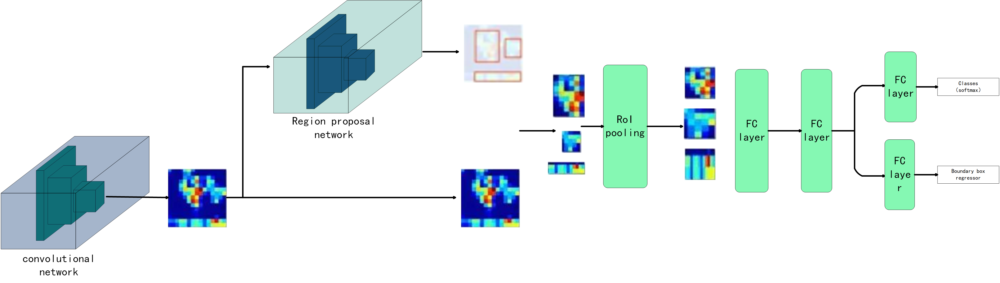
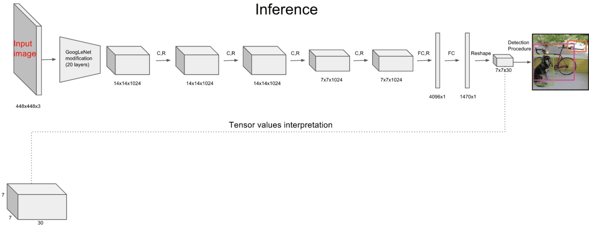

## 目标检测
参考
https://github.com/scutan90/DeepLearning-500-questions
https://blog.csdn.net/electech6/article/details/95240278
https://www.cnblogs.com/zyly/p/9651261.html

训练样本总结
https://www.mobibrw.com/2017/7900

### 概述
? 目标检测（Object Detection）的任务是找出图像中所有感兴趣的目标（物体），确定它们的类别和位置，是计算机视觉领域的核心问题之一。
由于各类物体有不同的外观、形状和姿态，加上成像时光照、遮挡等因素的干扰，目标检测一直是计算机视觉领域最具有挑战性的问题。

?
#### 计算机视觉中关于图像识别有四大类任务：

分类-Classification：解决“是什么？”的问题，即给定一张图片或一段视频判断里面包含什么类别的目标。

定位-Location：解决“在哪里？”的问题，即定位出这个目标的的位置。

检测-Detection：解决“是什么？在哪里？”的问题，即定位出这个目标的的位置并且知道目标物是什么。

分割-Segmentation：分为实例的分割（Instance-level）和场景分割（Scene-level），解决“每一个像素属于哪个目标物或场景”的问题。

#### 目标检测算法分类

1.Two stage目标检测算法（准确度高一些，但是速度慢）
  需要先算法产生目标候选框，也就是目标位置（region proposal，RP），然后再对候选框通过卷积神经网络做分类与回归。
? 
任务：特征提取―>生成RP―>分类/定位回归。

? 常见的two stage目标检测算法有：R-CNN、SPP-Net、Fast R-CNN、Faster R-CNN和R-FCN等。

2.One stage目标检测算法（速度快，但是准确性要低一些）

? 使用一个卷积神经网络CNN直接预测不同目标的类别与位置，不用RP，直接在网络中提取特征来预测物体分类和位置。

? 任务：特征提取―>分类/定位回归。

? 常见的one stage目标检测算法有：OverFeat、YOLOv1、YOLOv2、YOLOv3、SSD和RetinaNet等。

#### 应用
? 目标检测具有巨大的实用价值和应用前景。应用领域包括人脸检测、行人检测、车辆检测、飞机航拍或卫星图像中道路的检测、车载摄像机图像中的障碍物检测、医学影像在的病灶检测等。还有在安防领域中，可以实现比如安全帽、安全带等动态检测，移动侦测、区域入侵检测、物品看护等功能。

### 基于传统图像处理的目标检测（HOG+SVM）
#### 方向梯度直方图HOG(Histogram of Oriented Gradient)
HOG特征是一种在计算机视觉和图像处理中用来进行物体检测的特征描述子，是与SIFT、SURF、ORB属于同一类型的描述符。
HOG不是基于颜色值而是基于梯度来计算直方图的，它通过计算和统计图像局部区域的梯度方向直方图来构建特征。

#### 1.图片预处理
图片的预处理有很多，这个要根据实际情况来处理是否需要做平滑等操作
为了减少光照因素的影响，降低图像局部的阴影和光照变化所造成的影响，我们首先采用Gamma校正法对输入图像的颜色空间进行标准化(或者说是归一化)。
如果有兴趣可以读一下gamma校正 https://www.cnblogs.com/qiqibaby/p/5325193.html  

#### 2.边缘方向计算
 计算图像每个像素点的梯度、包括方向和大小直方图计算
 
#### 3.直方图计算
将图像划分成小的细胞单元(细胞单元可以是矩形的或者环形的)，比如大小为8×8，然后统计每一个细胞单元的梯度直方图，即可以得到一个细胞单元的描述符，将几个细胞单元组成一个block，
例如2×2个细胞单元组成一个block，将一个block内每个细胞单元的描述符串联起来即可以得到一个block的HOG描述符。

在说到统计一个细胞单元的梯度直方图时，我们一般考虑采用9个bin的直方图来统计这8×8个像素的梯度信息
 
 
#### 4.对block归一化
由于局部光照的变化，以及前景背景对比度的变化，使得梯度强度的变化范围非常大，这就需要对梯度做局部对比度归一化。
归一化能够进一步对光照、阴影、边缘进行压缩，使得特征向量对光照、阴影和边缘变化具有鲁棒性。

#### 5.样本HOG特征提
最后一步就是对一个样本中所有的块进行HOG特征的手机，并将它们结合成最终的特征向量送入分类器。

那么一个样本可以提取多少个特征呢？之前我们已经说过HOG特征的提取过程：

首先把样本图片分割为若干个像素的单元，然后把梯度方向划分为9个区间，在每个单元里面对所有像素的梯度方向在各个方向区间进行直方图统计，
得到一个9维的特征向量；

每相邻4个单元构成一个块，把一个块内的特征向量串联起来得到一个36维的特征向量；

用块对样本图像进行扫描，扫描步长为一个单元的大小，最后将所有的块的特征串联起来，就得到一个样本的特征向量；
例如：对于128×64的输入图片(后面我所有提到的图像大小指的是h×w)，每个块由2×2个cell组成，每个cell由8×8个像素点组成，每个cell提取9个bin大小的直方图，以1个cell大小为步长，那么水平方向有7个扫描窗口，垂直方向有5个扫描窗口，也就是说，一共有15?7?2?2?9=3780个特征。

#### 图像金字塔
图像金字塔有助于解决不同尺度下的目标检测问题
构建图像金字塔一般包含以下步骤(详细内容可以参考尺度空间理论）：

	获取图像；
	使用任意尺度的参数来调整(缩小)图像的大小；
	平滑图像(使用高斯模糊)；
	如果图像比最小尺度还大，从第一步开会重复这个过程；
如果需要输入图像的不同尺度下检测对象，则函数detectMultiScale()，
该函数有一个比较重要的参数scaleFactor(一般设置为1.3)，表示一个比率：即在每层金字塔中所获得的图像与上一层图像的比率，scaleFactor越小，金字塔的层数就越多，计算就越慢，计算量也会更大，但是计算结果相对更精确。	

#### 滑动窗口
滑动窗口是用在计算机视觉的一种技术，它包括图像中要移动部分(滑动窗口)的检查以及使用图像金字塔对各部分进行检测。这是为了在多尺度下检测对象。

滑动窗口通过扫描较大图像的较小区域来解决定位问题，进而在同一图像的不同尺度下重复扫描。

使用这种方法进行目标检测会出现一个问题：区域重叠，针对区域重叠问题，我们可以利用非极大值抑制，来消除重叠的窗口。	

#### HOG的优点： 

核心思想是所检测的局部物体外形能够被梯度或边缘方向的分布所描述，HOG能较好地捕捉局部形状信息，对几何和光学变化都有很好的不变性； 
HOG是在密集采样的图像块中求取的，在计算得到的HOG特征向量中隐含了该块与检测窗口之间的空间位置关系。
HOG的缺陷： 

很难处理遮挡问题，人体姿势动作幅度过大或物体方向改变也不易检测（这个问题后来在DPM中采用可变形部件模型的方法得到了改善）；
跟SIFT相比，HOG没有选取主方向，也没有旋转梯度方向直方图，因而本身不具有旋转不变性（较大的方向变化），其旋转不变性是通过采用不同旋转方向的训练样本来实现的；
跟SIFT相比，HOG本身不具有尺度不变性，其尺度不变性是通过缩放检测窗口图像的大小来实现的；
此外，由于梯度的性质，HOG对噪点相当敏感，在实际应用中，在block和cell划分之后，对于得到各个区域，有时候还会做一次高斯平滑去除噪点。

#### 实践

### RCNN
https://arxiv.org/abs/1311.2524

? R-CNN其实没有过多的使用“深度学习”思想，而是将“深度学习”和传统的“计算机视觉”的知识相结合

#### Selective Search
Selective Search选择性搜索是用于目标检测的区域提议算法，它计算速度快，具有很高的召回率，
基于颜色，纹理，大小和形状兼容计算相似区域的分层分组。学习更多关于Selective Search https://zhuanlan.zhihu.com/p/27467369

#### 训练步骤

1.提取候选区域，简单来说就是通过一些传统图像处理方法将图像分成很多小尺寸区域，然后根据小尺寸区域的特征合并小尺寸得到大尺寸区域，以实现候选区域的选取。
利用选择性搜索（Selective Search）算法提取所有proposals（大约2000幅images），调整（resize/warp）它们成固定大小，以满足 CNN输入要求（因为全连接层的限制）

2.提取特征向量对于上述获取的候选区域，需进一步使用CNN提取对应的特征向量，选择一个预训练 （pre-trained）神经网络（如AlexNet、VGG）。然后将feature map 保存到本地磁盘。
（需要注意的是 Alexnet 的输入图像大小是 227x227，而通过 Selective Search 产生的候选区域大小不一，
为了与 Alexnet 兼容，R-CNN 采用了非常暴力的手段，那就是无视候选区域的大小和形状，统一变换到 227x227 的尺寸）

4.训练SVM。通过上述卷积神经网络获取候选区域的特征向量，进一步使用SVM进行物体分类，利用feature map 训练SVM来对目标和背景进行分类

5.边框修正。训练将输出一些校正因子的线性回归分类器

### Fast R-CNN
https://arxiv.org/abs/1504.08083

Fast R-CNN通过CNN直接获取整张图像的特征图，再使用RoI Pooling Layer在特征图上获取对应每个候选框的特征，避免了R-CNN中的对每个候选框串行进行卷积（耗时较长）。

#### 训练步骤
	1.首先还是采用selective search提取2000个候选框RoI
	2.使用一个卷积神经网络对全图进行特征提取
	3.使用一个RoI Pooling Layer在全图特征上摘取每一个RoI对应的特征
	4.分别经过为21和84维的全连接层（并列的，前者是分类输出，后者是回归输出）

#### RoI的具体操作
将region proposal的特征向量划分为目标H×W大小的分块

对每一个分块中做MaxPooling（每个分块中含有多个网格，每个分块获取一个特征值）

将所有输出值组合起来便形成固定大小为H×W的feature map上的box坐标

RoI Pooling的输出

输出是batch个vector，其中batch的值等于RoI的个数，vector的大小为channel * w * h；RoI Pooling的过程就是将一个个大小不同的box矩形框，都映射成大小固定（w * h）的矩形框。

Fast R-CNN的主要贡献：

取代R-CNN的串行特征提取方式，直接采用一个CNN对全图提取特征(这也是为什么需要RoI Pooling的原因)。

用RoI pooling层替换最后一层的max pooling层，同时引入建议框数据，提取相应建议框特征

Fast R-CNN网络末尾采用并行的不同的全连接层，可同时输出分类结果和窗口回归结果，实现了end-to-end的多任务训练【建议框提取除外】，
也不需要额外的特征存储空间【R-CNN中的特征需要保持到本地，来供SVM和Bounding-box regression进行训练】

采用SVD对Fast R-CNN网络末尾并行的全连接层进行分解，减少计算复杂度，加快检测速度。

Fast R-CNN也有缺点，体现在耗时的selective search还是依旧存在。

### Faster R-CNN
https://arxiv.org/abs/1506.01497

#### 算法步骤
1.首先使用共享卷积层为全图提取特征feature maps

2.将得到的feature maps送入RPN，RPN生成待检测框(指定RoI的位置),并对RoI的包围框进行第一次修正

3.RoI Pooling Layer根据RPN的输出在feature map上面选取每个RoI对应的特征，并将维度置为定值

4.使用全连接层(FC Layer)对框进行分类，并且进行目标包围框的第二次修正。

尤其注意的是，Faster R-CNN真正实现了端到端的训练(end-to-end training)。Faster R-CNN最大特色是使用了RPN取代了SS算法来获取RoI，以下对RPN进行分析。

#### RPN
RPN网络用于生成区域候选图像块。该层通过softmax判断锚点(anchors)属于前景(foreground)或者背景(background)，
再利用边界框回归(bounding box regression)修正anchors获得精确的proposals。

##### anchor：
简单地说，RPN依靠一个在共享特征图上滑动的窗口，为每个位置生成9种预先设置好长宽比与面积的目标框(即anchor)。
这9种初始anchor包含三种面积(128×128，256×256，512×512)，每种面积又包含三种长宽比(1:1，1:2，2:1)

##### 判断前景或背景：
对于所有的anchors，首先需要判断anchor是是否为前景。对于第一个问题，RPN的做法是使用SoftmaxLoss直接训练，在训练的时候排除掉了超越图像边界的anchor；

##### 边框修正：
所以我们希望采用一种方法对候选区域的框进行微调，使得候选区域和实际框更加接近

	首先通过RPN生成约20000个anchor(40×60×9)。
	对20000个anchor进行第一次边框修正，得到修订边框后的proposal。
	对超过图像边界的proposal的边进行clip，使得该proposal不超过图像范围。
	忽略掉长或者宽太小的proposal。
	将所有proposal按照前景分数从高到低排序，选取前12000个proposal。
	使用阈值为0.7的NMS算法排除掉重叠的proposal。
	针对上一步剩下的proposal,选取前2000个proposal进行分类和第二次边框修正。

	
### Mask R-CNN
Mask R-CNN可以分解为如下的3个模块：Faster-RCNN、RoI Align和Mask。算法框架如下：

#### 算法步骤:

首先，输入一幅你想处理的图片，然后进行对应的预处理操作，或者预处理后的图片；

然后，将其输入到一个预训练好的神经网络中（ResNeXt等）获得对应的feature map；

接着，对这个feature map中的每一点设定预定个的RoI，从而获得多个候选RoI；

接着，将这些候选的RoI送入RPN网络进行二值分类（前景或背景）和BB回归，过滤掉一部分候选的ROI；

接着，对这些剩下的RoI进行RoIAlign操作（即先将原图和feature map的pixel对应起来，然后将feature map和固定的feature对应起来）；

最后，对这些RoI进行分类（N类别分类）、BB回归和MASK生成（在每一个ROI里面进行FCN操作）。

#### ROI Align

Mask R-CNN使用RoIAlign取代了Faster RCNN中的RoIPooling
RoIAlign：RoIPool的目的是为了从RPN网络确定的ROI中导出较小的特征图(a small feature map，eg 7x7)，ROI的大小各不相同，但是RoIPool后都变成了7x7大小。RPN网络会提出若干RoI的坐标以[x,y,w,h]表示，然后输入RoI Pooling，输出7x7大小的特征图供分类和定位使用。问题就出在RoI Pooling的输出大小是7x7上，如果RON网络输出的RoI大小是8*8的，那么无法保证输入像素和输出像素是一一对应，首先他们包含的信息量不同（有的是1对1，有的是1对2），其次他们的坐标无法和输入对应起来（1对2的那个RoI输出像素该对应哪个输入像素的坐标？）。这对分类没什么影响，但是对分割却影响很大。RoIAlign的输出坐标使用插值算法得到，不再量化；每个grid中的值也不再使用max，同样使用差值算法。

#### Mask
下图阐述了Mask R-CNN的Mask branch：

Mask R-CNN是一个非常灵活的框架，可以增加不同的分支完成不同的任务，
可以完成目标分类、目标检测、语义分割、实例分割、人体姿势识别等多种任务。

### YOLO
https://arxiv.org/abs/1506.02640

### YOLOv1

架构：然后，我们来看看YOLOv1的架构，YOLOv1由24层卷积层，4个最大池化层和2个全连接层组成，
常规操作，我们关注最后的输出是7x7x30，这里是7x7代表输入图像的7x7栅格，一一对应，30的前十个代表2个bounding boxes的坐标以及对象的置信度，后20个代表VOC数据集的20个类别。

#### 1 卷积层
采用Google inceptionV1网络，对应到上图中的第一个阶段，共20层。这一层主要是进行特征提取，从而提高模型泛化能力。但作者对inceptionV1进行了改造，他没有使用inception module结构，而是用一个1x1的卷积，并联一个3x3的卷积来替代。

#### 2 目标检测层
先经过4个卷积层和2个全连接层，最后生成7x7x30的输出。先经过4个卷积层的目的是为了提高模型泛化能力。Yolo将一副448x448的原图分割成了7x7个网格，
然后每个单元格负责去检测那些中心点落在该格子内的目标
每个单元格会预测界框（bounding box）以及边界框的置信度（confidence score）。

	所谓置信度其实包含两个方面，一是这个边界框含有目标的可能性大小Pr，二是这个边界框的准确度IOU.置信度可以定义为  Pr*IOU
	每个边界框的预测值实际上包含5个元素(x,y,w,h,c) x,y是中心坐标的预测值；w,h是是边界框的宽与高; c是置信度。

交并比（IOU）: 这是一个评价两个bounding box相互重合程度的指标，这个指标等于两个bounding box的交集面积除以它们并集的面积。当两个bounding box没有任何交集时，IoU为0，即IoU的最小取值，当两个bounding box完全重合时，IoU为1，即IoU的最大取值，所以IoU的取值范围是[0,1]。

#### 3 推断：
给定一张图，运行YOLO后，总共有98个bounding box输出出来，可以通过非极大值抑制算法得到最后可靠的结果。

	第一步根据阈值去除那些置信度低的bounding box，然后进入一个循环，首先挑选出最大置信度的bounding box作为预测输出，(先过滤掉score低于阈值的box)
	
	第二步去除那些与这个最大置信度的bounding box的IoU超过0.5的bounding box，因为我们可以看到一个对象有很多bounding box，它们很多是相交的，(对剩下的box进行NMS非极大值抑制，去除掉重叠度比较高的box)
	
	这样一个对象的bounding box就确定好了，然后，我们再进入循环，找出下一个对象的bounding box，最后直到没有剩余的bounding box，循环结束。

#### 4 Yolo损失函数
yolo的损失函数包含三部分，位置误差，confidence误差，分类误差

#### 5 缺点

	每个网格只对应两个bounding box，当物体的长宽比不常见（也就是训练数据集覆盖不到时），效果很差。
	原始图片只划分为7x7的网格，当两个物体靠的很近时，效果很差
	最终每个网格只对应一个类别，容易出现漏检（物体没有被识别到）。
	对于图片中比较小的物体，效果很差。这其实是所有目标检测算法的通病，SSD对它有些优化，我们后面再看。

### YOLOV2
跟V1就是Better，Faster，Stronger。
#### Better
批归一化，高分辨分类器，锚盒，维度聚类，细粒度特征以及多尺度训练。

1.批归一化 Batch Nomalization：对数据进行预处理（统一格式、均衡化、去噪等）能够大大提高训练速度，提升训练效果。

2.高分辨率模型（High Resolution Classifier）
fine-tuning：用已经训练好的模型，加上自己的数据集，来训练新的模型。即使用别人的模型的前几层，来提取浅层特征，而非完全重新训练模型，从而提高效率。一般新训练模型准确率都会从很低的值开始慢慢上升，但是fine-tuning能够让我们在比较少的迭代次数之后得到一个比较好的效果。
YOLOv2将预训练分成两步：先用224*224的输入在ImageNet数据集训练分类网络，大概160个epoch（将所有训练数据循环跑160次）后将输入调整到448*448，再训练10个epoch（这两步都是在ImageNet数据集上操作）。然后利用预训练得到的模型在检测数据集上fine-tuning。这样训练得到的模型，在检测时用448*448的图像作为输入可以顺利检测。

3、引入Anchor（Convolutional with Anchor Boxes）
YOLOv1将输入图像分成7*7的网格，每个网格预测2个Bounding Box，因此一共有98个Box，同时YOLOv1包含有全连接层，从而能直接预测Bounding Boxes的坐标值，但也导致丢失较多的空间信息，定位不准。

YOLOv2首先将YOLOv1网络的FC层和最后一个Pooling层去掉，使得最后的卷积层可以有更高分辨率的特征，然后缩减网络，用416*416大小的输入代替原来的448*448，使得网络输出的特征图有奇数大小的宽和高，进而使得每个特征图在划分单元格（Cell）的时候只有一个中心单元格（Center Cell）。

YOLOv2通过引入Anchor Boxes，通过预测Anchor Box的偏移值与置信度，而不是直接预测坐标值。YOLOv2的卷积层采用32这个值来下采样图片，所以通过选择416*416用作输入尺寸最终能输出一个13*13的特征图。若采用FSRCNN中的方式，每个Cell可预测出9个Anchor Box，共13*13*9=1521个（YOLOv2确定Anchor Boxes的方法见是维度聚类，每个Cell选择5个Anchor Box）。

4、维度聚类（Dimension Clusters）
YOLOv2使用K-means聚类方法类训练Bounding Boxes，可以自动找到更好的宽高维度的值用于一开始的初始化。传统的K-means聚类方法使用的是欧氏距离函数，意味着较大的Anchor Boxes会比较小的Anchor Boxes产生更多的错误，聚类结果可能会偏离。由于聚类目的是确定更精准的初始Anchor Box参数，即提高IOU值，这应与Box大小无关，因此YOLOv2采用IOU值为评判标准，即K-means 采用的距离函数（度量标准） 为：
d=1-IOU

5、细粒度特征
YOLOv2通过添加一个转移层（Passthrough Layer：Route + Reorg），把高分辨率的浅层特征连接到低分辨率的深层特征（把特征堆积在不同Channel中）而后进行融合和检测。具体操作是先获取前层的26*26的特征图，将其同最后输出的13*13的特征图进行连接，而后输入检测器进行检测（检测器的FC层起到了全局特征融合的作用），以此来提高对小目标的检测能力。

6、多尺度训练
为了适应不同尺度下的检测任务，YOLOv2在训练网络时，其在检测数据集上fine-tuning时候采用的输入图像的size是动态变化的。具体来讲，每训练10个Batch，网络就会随机选择另一种size的输入图像。因为YOLOv2用到了参数是32的下采样，因此也采用32的倍数作为输入的size，即采用{320,352,…,608}的输入尺寸（网络会自动改变尺寸，并继续训练的过程）。

这一策略让网络在不同的输入尺寸上都能达到较好的预测效果，使同一网络能在不同分辨率上进行检测。输入图片较大时，检测速度较慢，输入图片较小时，检测速度较快，总体上提高了准确率，因此多尺度训练算是在准确率和速度上达到一个平衡。

#### faster
YOLOv2简化了网络，只使用了19卷积层和5个池化层（Darknet-19），不仅通过一系列的改进使精度高了，速度方面依然比YOLOv1还要快。

#### Stronger
强大之处体现在YOLO9000，YOLO9000是在YOLOv2的基础上提出的一种可以检测超过9000个类别的模型,其主要贡献点在于提出了一种分类和检测的联合训练策略。众多周知，检测数据集的标注要比分类数据集打标签繁琐的多，所以ImageNet分类数据集比VOC等检测数据集高出几个数量级。在YOLO中，边界框的预测其实并不依赖于物体的标签，所以YOLO可以实现在分类和检测数据集上的联合训练。对于检测数据集，可以用来学习预测物体的边界框、置信度以及为物体分类，
而对于分类数据集可以仅用来学习分类，但是其可以大大扩充模型所能检测的物体种类；

### YOLO3
YOLOv3给出的是一个科技报告，在保持实时性的基础上，对YOLOv2进行了几点改进，主要有三点：采用逻辑回归预测置信度和进行分类，从三个尺度上预测b-box的坐标以及特征提取器发生变化。

逻辑回归的使用：在YOLOv2中，每个cell是直接通过网络回归预测b-box坐标和置信度的，YOLOv3则将置信度和坐标分开预测，坐标预测还是通过网络进行预测，而置信度则是单独通过逻辑回归进行预测。在分类上，没有使用softmax多分类，作者也指出softmax最终对性能也没有提升，而且softmax假设是每个box只有一个类，这对迁移到更大有多种类别标签的数据集是没有好处的，所以作者使用多个逻辑回归来预测分类，使用二元交叉熵计算分类损失。

特征提取器：YOLOv3重新训练了一个新的特征提取器――DarkNet-53，使用了残差网络，相比最先进的特征提取器，性能相当，但浮点数运算更少，速度更快，下采样没有使用池化操作，而是通过卷积步长来实现。

多尺度预测坐标：作者借由FPN的思想，引用中间层的输出与后层输出进行融合，进行三个尺度预测，每个尺度的每个cell预测3个坐标，以上面为例，下采样32倍，最后一起的输出是8x8x1024，通过卷积层和逻辑回归得到8x8x255（255=3x（5+80），5是坐标加置信度，80是coco类别），这就是第一个尺度的预测输出，第二个尺度是8x8x1024通过上采样与卷积通过缩放变成16x16x512，然后与上一个stage的16x16x512进行concat，然后通过相似的方式生成16x16x255，类似的操作得到，得到32x32x255。

### SSD
https://arxiv.org/abs/1512.02325
Faster R-CNN准确率mAP较高，漏检率recall较低，但速度较慢。而Yolo则相反，速度快，但准确率和漏检率不尽人意。SSD综合了他们的优缺点，对输入300x300的图像，在voc2007数据集上test，能够达到58 帧每秒( Titan X 的 GPU )，72.1%的mAP。
SSD和Yolo一样都是采用一个CNN网络来进行检测，但是却采用了多尺度的特征图，SSD网络结构如下图：

#### 1 卷积层
SSD论文采用了VGG16的基础网络，其实这也是几乎所有目标检测神经网络的惯用方法。

#### 2 目标检测层
这一层由5个卷积层和一个平均池化层组成。去掉了最后的全连接层。SSD认为目标检测中的物体，只与周围信息相关，它的感受野不是全局的，故没必要也不应该做全连接。

2.1 多尺寸feature map上进行目标检测
每一个卷积层，都会输出不同大小感受野的feature map。在这些不同尺度的feature map上，进行目标位置和类别的训练和预测，从而达到多尺度检测的目的，可以克服yolo对于宽高比不常见的物体，识别准确率较低的问题。而yolo中，只在最后一个卷积层上做目标位置和类别的训练和预测。这是SSD相对于yolo能提高准确率的一个关键所在。

2.2 设置先验框
在Yolo中，每个单元预测多个边界框，但是其都是相对这个单元本身（正方块），但是真实目标的形状是多变的，Yolo需要在训练过程中自适应目标的形状。而SSD和Faster R-CNN相似，也提出了anchor的概念。卷积输出的feature map，每个点对应为原图的一个区域的中心点。以这个点为中心，构造出6个宽高比例不同，大小不同的anchor（SSD中称为default box）。每个anchor对应4个位置参数(x,y,w,h)和21个类别概率（voc训练集为20分类问题，在加上anchor是否为背景，共21分类）。

#### 3 筛选层
和yolo的筛选层基本一致，同样先过滤掉类别概率低于阈值的default box，再采用NMS非极大值抑制，筛掉重叠度较高的。只不过SSD综合了各个不同feature map上的目标检测输出的default box。

### RetinaNet
https://arxiv.org/abs/1708.02002
https://blog.csdn.net/JNingWei/article/details/80038594
RetinaNet本质上是Resnet + FPN + 两个FCN子网络。
以下为RetinaNet目标框架框架图。

一般主干网络可选用任一有效的特征提取网络如vgg16或resnet系列，此处作者分别尝试了resnet-50与resnet-101。而FPN则是对resnet-50里面自动形成的多尺度特征进行了强化利用，从而得到了表达力更强、包含多尺度目标区域信息的feature maps集合。最后在FPN所吐出的feature maps集合上，分别使用了两个FCN子网络（它们有着相同的网络结构却各自独立，并不share参数）用来完成目标框类别分类与位置回归任务。

问题：one-stage方法，速度快但不如two-stage精度高。分析原因：正负样本不均衡。

1.什么是“类别不平衡”呢？

详细来说，检测算法在早期会生成一大波的bbox。而一幅常规的图片中，顶多就那么几个object。这意味着，绝大多数的bbox属于background。

2.“类别不平衡”又如何会导致检测精度低呢？

因为bbox数量爆炸。
正是因为bbox中属于background的bbox太多了，所以如果分类器无脑地把所有bbox统一归类为background，accuracy也可以刷得很高。于是乎，分类器的训练就失败了。分类器训练失败，检测精度自然就低了。

3.那为什么two-stage系就可以避免这个问题呢？

因为two-stage系有RPN罩着。
第一个stage的RPN会对anchor进行简单的二分类（只是简单地区分是前景还是背景，并不区别究竟属于哪个细类）。经过该轮初筛，属于background的bbox被大幅砍削。虽然其数量依然远大于前景类bbox，但是至少数量差距已经不像最初生成的anchor那样夸张了。就等于是 从 “类别 极 不平衡” 变成了 “类别 较 不平衡” 。
不过，其实two-stage系的detector也不能完全避免这个问题，只能说是在很大程度上减轻了“类别不平衡”对检测精度所造成的影响。
接着到了第二个stage时，分类器登场，在初筛过后的bbox上进行难度小得多的第二波分类(这次是细分类)。这样一来，分类器得到了较好的训练，最终的检测精度自然就高啦。但是经过这么两个stage一倒腾，操作复杂，检测速度就被严重拖慢了。

4.那为什么one-stage系无法避免该问题呢？

因为one stage系的detector直接在首波生成的“类别极不平衡”的bbox中就进行难度极大的细分类，意图直接输出bbox和标签（分类结果）。而原有交叉熵损失(CE)作为分类任务的损失函数，无法抗衡“类别极不平衡”，容易导致分类器训练失败。因此，one-stage detector虽然保住了检测速度，却丧失了检测精度。

#### Focal Loss
公式：FL(pt)=?αt(1?pt)γlog(pt)
本质改进点在于，在原本的 交叉熵误差 (CE(pt)=?αtlog(pt)) 前面乘上了 (1?pt)γ 这一权重。

乘上了该权重，量大的类别所贡献的loss被大幅砍削，量少的类别所贡献的loss几乎没有多少降低。虽然整体的loss总量减少了，但是训练过程中量少的类别拥有了更大的话语权，更加被model所关心了。

